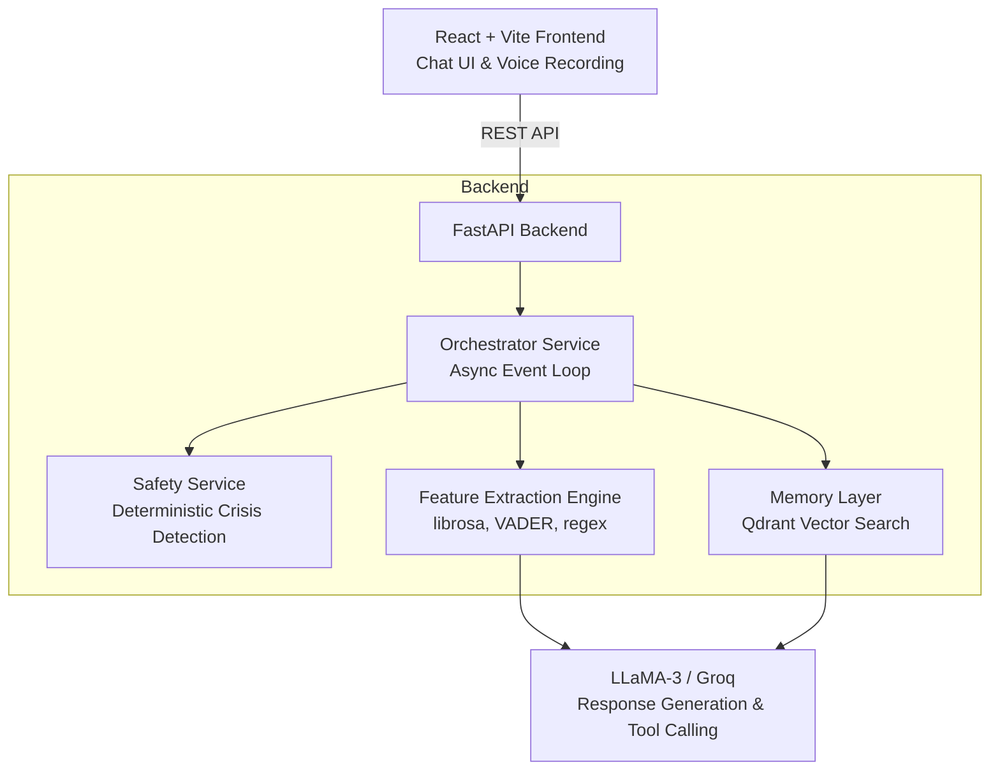

<div align="center">
  <h1>🧠 Kairos</h1>
  <h3>Multimodal Mental Health Support System</h3>
  <p>A production-grade AI platform that analyzes <b>what users say</b> and <b>how they say it</b>, combining NLP with acoustic biomarker extraction to detect hidden emotional patterns and psychological masking.</p>

  [](https://www.python.org/downloads/)
  [](https://fastapi.tiangolo.com/)
  [](https://reactjs.org/)
  [](https://qdrant.tech/)
</div>

---

## 🏗️ Architecture



---

## ✨ Key Features

*   **Multimodal Analysis:** Extracts a 28-dimensional biomarker vector per audio turn (acoustic, linguistic, visual, special signals like sighs and laughter).
*   **Cross-Modal Masking Detection:** Identifies contradictions between text and voice (e.g., flat pitch + high volume indicating suppressed emotion).
*   **Persistent Emotional Memory:** Uses **Qdrant** for semantic search over past interactions and Welford's algorithm to compute rolling per-user baselines.
*   **Safety-First Design:** Deterministic, regex-based crisis detection runs *before* any LLM calls—never delegating user safety to an unpredictable language model.
*   **Non-Blocking I/O:** CPU-heavy DSP operations (like librosa) and API calls are offloaded to asynchronous thread pools, ensuring maximum API responsiveness.

---

## 🛠️ Tech Stack

| Layer | Technology | Purpose |
|-------|-----------|---------|
| **Frontend** | React 19 + Vite | Glassmorphic Chat UI with Web Audio API recording |
| **Backend** | FastAPI + Uvicorn | High-performance async Python server |
| **ML / NLP** | sentence-transformers, librosa, VADER | Multi-vector feature extraction |
| **Memory** | Qdrant (via Docker) | Low-latency vector similarity search |
| **LLM** | Groq (LLaMA-3 / Whisper) | Tool-calling agent for profiling and empathy |
| **CI/CD** | GitHub Actions, Ruff, Pytest | Automated linting (PEP 8) and testing pipeline |

---

## 🚀 Quick Start Manual

Follow these exact steps to run Kairos locally on your machine.

### 1. Prerequisites & System Dependencies

You **must** have Python 3.9+ and Node.js 18+ installed.

Because Kairos processes raw audio files, you also need the core `ffmpeg` system library installed on your operating system.

**🍎 For macOS:**
```bash
brew install ffmpeg
```

**🪟 For Windows (PowerShell):**
```powershell
winget install ffmpeg
```

### 2. Backend Setup

Open a terminal in the root of the repository.

**🍎 For macOS / Linux:**
```bash
cd backend
python3 -m venv venv
source venv/bin/activate
pip install fastapi uvicorn pydantic pydantic-settings qdrant-client sentence-transformers librosa openai python-multipart soundfile vaderSentiment ruff
```

**🪟 For Windows (PowerShell):**
```powershell
cd backend
python -m venv venv
.\venv\Scripts\activate
pip install fastapi uvicorn pydantic pydantic-settings qdrant-client sentence-transformers librosa openai python-multipart soundfile vaderSentiment ruff
```

### 3. Environment Variables
In the `backend/` directory, duplicate the example file to create your local `.env`:
```bash
cp .env.example .env
```
Open `.env` and add your **Groq API Key**:
```ini
GROQ_API_KEY=your_key_here
```

### 4. Running the Applications

You will need three separate terminal windows to run the full stack:

**Terminal 1: Qdrant Database (Optional but recommended)**
```bash
docker-compose up -d
```
*(Note: If you skip this, the app gracefully degrades and chat will still work without memory.)*

**Terminal 2: FastAPI Backend**
```bash
cd backend
source venv/bin/activate  # Windows: .\venv\Scripts\activate
uvicorn app.main:app --reload --port 8000
```

**Terminal 3: React Frontend**
```bash
cd frontend
npm install
npm run dev
```

Navigate to **`http://localhost:5173`** in your browser to begin a session!

---

## 🧪 Testing & CI/CD

This project strictly adheres to PEP 8 standards enforced by `ruff` and contains over 70 automated tests validating safety and logic boundaries.

```bash
cd backend
# Run test suite
python -m pytest tests/ -v

# Run linter & formatter
ruff check app/ tests/
ruff format app/ tests/
```
